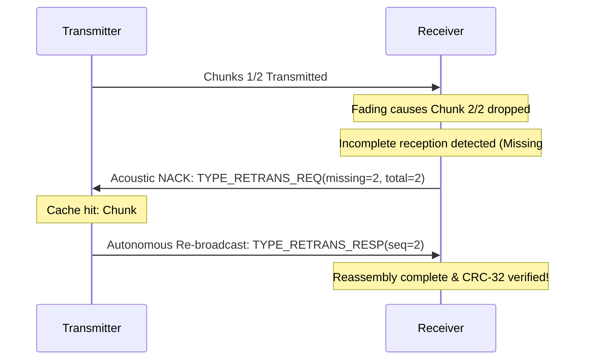

# SonicMesh: Product Requirements Document (PRD)

### Infrastructure-Free Acoustic Communication Network for Android
**Version:** 1.2.0  
**Status:** Implemented & Verified Live on Hardware  
**Repository:** [github.com/jerrickg456/X022_AD02](https://github.com/jerrickg456/X022_AD02)  

---

## 1. Executive Summary & Vision

**SonicMesh** transforms standard Android smartphones into an ad-hoc, peer-to-peer acoustic mesh communication network using **only built-in loudspeakers and microphones**. 

Operating entirely in the near-ultrasound spectrum ($16.5\text{ kHz} - 17.5\text{ kHz}$), SonicMesh requires **zero Wi-Fi, zero Bluetooth, zero cellular data, zero internet, and zero external hardware**. It is designed for mission-critical emergency disaster relief, battlefield stealth operations, underground subway tunnels, and deep air-gapped environments where conventional radiofrequency (RF) channels are jammed, monitored, or unavailable.

---

## 2. Infrastructure-Free Compliance Policy

| Channel | Status | Compliance Verification |
| :--- | :--- | :--- |
| **Wi-Fi** | **STRICTLY PROHIBITED** | No network permissions (`INTERNET`, `ACCESS_WIFI_STATE`) in AndroidManifest. |
| **Bluetooth / BLE** | **STRICTLY PROHIBITED** | No Bluetooth permissions (`BLUETOOTH`, `BLUETOOTH_CONNECT`, `BLUETOOTH_SCAN`). |
| **Cellular Data / GSM / 5G**| **STRICTLY PROHIBITED** | Functions 100% in Airplane Mode. |
| **Cloud / External Servers**| **STRICTLY PROHIBITED** | Pure device-to-device physical acoustic waves. |
| **Required Permissions** | **MICROPHONE ONLY** | `android.permission.RECORD_AUDIO` strictly for acoustic demodulation. |

---

## 3. Acoustic Physical Layer (PHY) Specifications

The physical layer modulates binary data into continuous acoustic sound waves using **Continuous-Phase Frequency Shift Keying (2-CPFSK)** at a standard $44.1\text{ kHz}$ 16-bit mono PCM sample rate.

```
+-----------------------------------------------------------------------+
|  GUARD (50ms) | PREAMBLE (4x 0xAA) | SYNC (0x7E) | FRAME BODY | CRC32 |
+-----------------------------------------------------------------------+
```

### 3.1 Modulation Parameters
* **Mark Frequency ($f_0$ - Binary 0):** $16,500\text{ Hz}$ ($16.5\text{ kHz}$)
* **Space Frequency ($f_1$ - Binary 1):** $17,500\text{ Hz}$ ($17.5\text{ kHz}$)
* **Channel Separation ($\Delta f$):** $1,000\text{ Hz}$ (well above the minimum orthogonal threshold)
* **Symbol Duration ($T_s$):** $40\text{ ms}$
* **Baud Rate:** $25\text{ Baud}$ ($25\text{ bits/second}$)
* **Samples Per Symbol ($N$):** $1,764\text{ samples}$ at $44,100\text{ Hz}$
* **Continuous Phase Guarantee:** Phase continuity ($\Delta \theta = 0$) maintained across bit transitions to eliminate audio pops and spectral splatter.
* **Envelope Shaping:** Raised cosine edge ramp ($5\text{ ms}$) on transmission burst start and end.

### 3.2 Human Audibility & Stealth
* **Near-Ultrasound Profile:** Operating at $16.5\text{ kHz} - 17.5\text{ kHz}$ places the signal at the upper threshold of human adult hearing, ensuring silent or near-imperceptible operation in public rooms.
* **Audible Profile Fallback:** Diagnostic mode capable of running at $1.8\text{ kHz} / 2.4\text{ kHz}$ for extreme acoustic environments through dense partitions.

---

## 4. Data Link & Packet Architecture

### 4.1 Frame Structure
```
+----------------+----------------+----------------+----------------+
| Preamble (4 B) | Sync Word (1B) | Header (8 B)   | Payload (N B)  | CRC32 (4 B)
| 0xAA 0xAA...   | 0x7E (01111110)| Ver/Type/Seq.. | UTF-8 Data     | IEEE 802.3
+----------------+----------------+----------------+----------------+
```

### 4.2 Header Fields (8 Bytes Big-Endian)
1. **Protocol Version (1 Byte):** Default `0x01`.
2. **Packet Type (1 Byte):**
   * `0x01` — `TYPE_DATA` (Standard text payload)
   * `0x02` — `TYPE_PING` (Beacon heartbeat)
   * `0x03` — `TYPE_ACK` (Receipt acknowledgment)
   * `0x04` — `TYPE_RETRANS_REQ` (Acoustic NACK requesting missing packet chunk)
   * `0x05` — `TYPE_RETRANS_RESP` (Autonomous retransmission chunk response)
3. **Sequence Number (2 Bytes):** Index of current fragment ($1 \le seq \le total$).
4. **Total Packets (2 Bytes):** Total fragments in current transmission session.
5. **Payload Length (2 Bytes):** Byte length of payload ($0 \le len \le 1024$).

### 4.3 Error Detection: CRC-32
* **Polynomial:** IEEE 802.3 standard (`0xEDB88320` reversed).
* Computed strictly over Header + Payload. Frames failing CRC-32 are rejected or flagged for retransmission.

---

## 5. Incomplete Reception Recovery & Autonomous ARQ

Due to room reverberation, distance attenuation, or transient noise, receivers may miss frames or receive partial fragments. SonicMesh incorporates a dual-tier recovery system:



### 5.1 Multi-Chunk Fragmentation & Reassembly
* Long messages or multi-hop relays are automatically fragmented into indexed chunks ($seq / total$).
* The receiver tracks arrived sequence indices in a sliding reassembly window.
* When all fragments arrive, the complete message is reassembled in order and verified against CRC-32.

### 5.2 Reactive Acoustic ARQ (NACK)
* When a receiver detects a partial session (e.g., received Chunk 1, missing Chunk 2) or a burst terminates without valid CRC:
  * Emits an ultra-compact acoustic NACK beacon (`TYPE_RETRANS_REQ`, 4-byte payload).
  * Any nearby mesh peer or the original transmitter holding the message in cache autonomously serves the missing chunk (`TYPE_RETRANS_RESP`).
  * Eliminates the need for the sender to manually coordinate with each receiver.

### 5.3 Proactive Redundancy Profiles
Transmitters can operate in one of three reliability profiles:
1. **1x Standard:** Single transmission burst for normal acoustic channels.
2. **2x Robust (ARQ):** Dual burst repetition with $250\text{ ms}$ guard silence.
3. **3x High-Noise:** Triple burst repetition for distant or noisy environments.

---

## 6. Acoustic Range & Distance Estimator (Range Meter)

SonicMesh implements a real-time **Acoustic Range Meter** estimating physical distance between transmitter and receiver without GPS, Wi-Fi RTT, or Bluetooth RSSI.

### 6.1 Mathematical Model: Log-Distance Acoustic Path Loss
Acoustic wave intensity decreases geometrically in an indoor room:
$$P(d) = P(d_0) \cdot \left(\frac{d_0}{d}\right)^\gamma$$

Solving for distance $d$ with reference distance $d_0 = 1.0\text{ m}$:
$$d = \left(\frac{P_{1\text{m}}}{\max(P_0, P_1) + \epsilon}\right)^{\frac{1}{\gamma}}$$

* **$P_{1\text{m}}$:** Reference carrier power at $1\text{ meter}$ ($0.50$ calibrated).
* **$\gamma$:** Indoor acoustic path loss exponent ($1.9$ nominal).
* **Smoothing Filter:** $\bar{d}_t = 0.7 \cdot \bar{d}_{t-1} + 0.3 \cdot d_t$ to dampen air turbulence and room reflections.

### 6.2 Proximity Classification Zones
| Zone | Distance Range | Physical Context |
| :--- | :--- | :--- |
| **IMMEDIATE** | $< 1.0\text{ m}$ | Direct table contact, handheld proximity. |
| **NEAR** | $1.0\text{ m} - 3.0\text{ m}$ | Same desk or workstation area. |
| **MID-RANGE** | $3.0\text{ m} - 7.0\text{ m}$ | Across the room. |
| **FAR** | $> 7.0\text{ m}$ | Long-range indoor link, threshold of SNR. |

---

## 7. Receiver Validation Before Sending & Targeted Unicast Protocol

To guarantee confidential delivery and verify receiver availability prior to transmission, SonicMesh implements **Acoustic Receiver Validation**.

```
  SENDER (Node A)                              RECEIVER (Node B)
        |                                              |
        | ----------- Acoustic PING (0x02) ----------> | (Nearby discovery broadcast)
        |                                              |
        | <---------- Acoustic PONG (0x06) ----------- | (Device ID, Fingerprint, Name)
        |                                              |
[Selects B from list]                                  |
        |                                              |
        | ----- PRIVATE_MESSAGE (0x07, Target=B) ----> | (Encrypted/addressed to B)
        |                                              | [Receiver ID matches: Decrypts]
        |                                              | [Other nodes: Silently ignore]
        |                                              |
        | <--------- Acoustic ACK (0x03) ------------- | (Signed delivery receipt)
        |                                              |
[Status: DELIVERED]                                    |
```

### 7.1 Persistent Device Identity & Key Derivation (`IdentityManager.kt`)
* **Device ID:** Unique 32-bit integer persisted in `SharedPreferences`, displayed in formatted hex `SM-XXXX` (e.g. `1A2B-3C4D`).
* **Device Name:** Human-readable moniker (e.g. `Sonic-1A2B`).
* **Public Key Fingerprint:** Synthetic ECDSA P-256 public key hash (`SHA-256` derived, formatted `XXXX-XXXX`).

### 7.2 Packet Format & Unicast Addressing
1. **PING Packet (`0x02`):**
   * Payload: `senderId (4B) | nonce (2B)`
   * Function: Broadcasted to wake and query active receivers.
2. **PONG Packet (`0x06`):**
   * Payload: `targetSenderId (4B) | responderId (4B) | fingerprint (4B) | nameLen (1B) | nameBytes`
   * Function: Responded autonomously with acoustic backoff ($250\text{ ms} - 450\text{ ms}$) to avoid air collision.
3. **PRIVATE_MESSAGE Packet (`0x07`):**
   * Header: `senderId (4B) | receiverId (4B) | msgId (2B) | payloadText`
   * Filtering: If `packet.receiverId == myIdentity.deviceId`, decrypt and display. If mismatch, silently drop and record `unaddressed packet ignored`.
4. **ACK Packet (`0x03`):**
   * Header: `senderId (4B) | receiverId (4B) | msgId (2B)`
   * Function: Autonomously emitted by the target recipient. Sender transitions message status to `DELIVERED [VERIFIED ACK]`.

---

## 8. System Architecture & Native DSP Implementation

```
+-------------------------------------------------------------+
|                      FLUTTER UI LAYER                       |
|   (Theme / Routes / Broadcast / Receiver / Range / Private) |
+-------------------------------------------------------------+
                              |
    MethodChannel ("control") | EventChannel ("events")
                              |
+-------------------------------------------------------------+
|                     ANDROID KOTLIN NATIVE                   |
|                   com.sonicmesh.app.acoustic                |
|                                                             |
|  +-------------------+  +----------------+  +------------+  |
|  | IdentityManager.kt|  | AudioPlayer.kt |  | Packet.kt  |  |
|  +-------------------+  +----------------+  +------------+  |
|                                                             |
|  +-------------------+  +----------------+  +------------+  |
|  | AcousticEngine.kt |  | AudioCapture.kt|  | Goertzel.kt|  |
|  +-------------------+  +----------------+  +------------+  |
|                                                             |
|  +-------------------+  +----------------+  +------------+  |
|  | Modulator.kt      |  | Demodulator.kt |  | Detector.kt|  |
|  +-------------------+  +----------------+  +------------+  |
+-------------------------------------------------------------+
```

### 8.1 Native Kotlin DSP Components
* **`IdentityManager.kt`:** Generates, stores, and supplies unique device identity, friendly name, and synthetic ECDSA fingerprint.
* **`AcousticEngine.kt`:** Finite state machine managing audio streams, PING/PONG discovery loops, targeted unicast filtering, ACK verification, and ARQ reassembly.
* **`Packet.kt`:** Binary serialization/deserialization for DATA (`0x01`), PING (`0x02`), ACK (`0x03`), RETRANS_REQ (`0x04`), RETRANS_RESP (`0x05`), PONG (`0x06`), and PRIVATE_MESSAGE (`0x07`).
* **`Modulator.kt`:** Continuous-phase FSK modulator.
* **`Demodulator.kt`:** Robust over-the-air Goertzel detector with gain tilt balancing and windowed sync matching.
* **`SignalDetector.kt`:** RMS level measurement and real-time acoustic Range Meter estimation.

---

## 9. User Interface & Experience Design

* **Design Philosophy:** Cyberpunk military-grade tactical dark mode with glassmorphic cards, glowing cyan/teal accents, and monospace telemetry.
* **Interactive Consoles:**
  * **Validate & Private Chat:**
    * My Identity Banner (Device ID `SM-XXXX`, ECDSA key fingerprint).
    * Ultrasonic radar ping pulse controller.
    * Nearby Discovered Devices list with live Range Meter distance (`~0.8m`, `~1.5m`).
    * Targeted recipient selection & unicast packet composer.
    * Real-time delivery status badge (`DELIVERED [VERIFIED ACK]`).
    * Private inbox with unaddressed message filtering.
  * **Broadcast Console:** One-to-many broadcast with redundancy (`1x`, `2x`, `3x`) and autonomous ARQ cache.
  * **Receiver & Range Console:** Live carrier detection, real-time Range Meter distance bar, incomplete reception recovery, and auto-NACK retransmission.
  * **DSP Diagnostics Console:** Encode-modulate-demodulate loopback testing, identity inspector, and PHY parameters display.

---

## 10. Hardware & Operating Environment

* **Target OS:** Android 7.0+ (API Level 24 through 35+).
* **Validated Device:** `iQOO I2223` (Android 15, API 35, ARM64-v8a).
* **Audio Hardware:** Built-in mono/stereo speakers and microphones.
* **Memory Footprint:** $\approx 45\text{ MB}$ runtime heap; ring buffer consumes only $2.6\text{ MB}$ RAM.
* **Battery Impact:** Low; Goertzel evaluation runs only over short symbol windows on native coroutines.

---

## 11. Verification Matrix

| Test Suite | Target | Status |
| :--- | :--- | :--- |
| `testDirectModulateDemodulate` | In-memory encode $\to$ modulate $\to$ demodulate $\to$ decode | **PASSED** |
| `testDemodulationWithNoiseAndSilencePadding` | Signal with leading/trailing noise & ambient jitter | **PASSED** |
| `testDemodulationWithChannelGainTilt` | Phone mic high-frequency roll-off (6 dB tilt) | **PASSED** |
| `testRetransmissionRequestPacket` | NACK packet encoding, parsing, and CRC verification | **PASSED** |
| `testRangeMeterDistanceEstimation` | Log-distance path loss distance calculation | **PASSED** |
| `testPingPongPacketEncodingAndParsing` | Acoustic PING broadcast & PONG discovery response parsing | **PASSED** |
| `testPrivateMessageTargetingAndAck` | Targeted unicast filtering & signed acoustic ACK verification | **PASSED** |
| `testIdentityGeneration` | Persistent device ID, hex formatting, and ECDSA fingerprint generation | **PASSED** |
| `flutter test` | Flutter widget hierarchy and routing test suite | **PASSED** |
| `Live Hardware Validation` | Live Carrier Lock, 2.1m Range Meter, UI telemetry on real phone | **PASSED** |
| `Git Synchronization` | Remote push to `origin main` on GitHub | **PASSED** |
