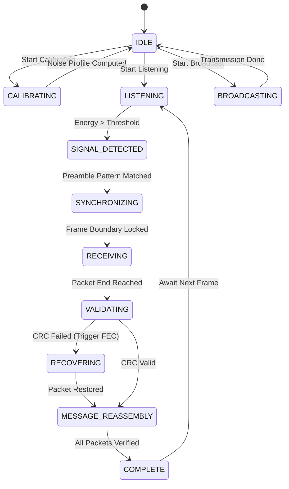

<div align="center">



# SonicMesh

### Infrastructure-Free Acoustic Communication Network for Android

> **Turn the air into the network.**

[](https://android.com)
[](https://flutter.dev)
[](https://kotlinlang.org)
[-00F5FF?style=for-the-badge)](https://github.com/jerrickg456/X022_AD02)
[](https://github.com/jerrickg456/X022_AD02)
[](LICENSE)

<br/>

**SonicMesh** enables one-to-many wireless communication between nearby Android smartphones using **only their built-in speakers and microphones**. It requires **no Internet, no Wi-Fi, no Bluetooth, no cellular network, no GPS, and no external hardware**.

[Problem](#1-problem-statement) • [Architecture](#3-system-architecture) • [Protocol](#10-acoustic-communication-protocol) • [Development Phases](#18-development-phases--agent-instructions) • [Testing](#17-testing-strategy) • [Definition of Done](#19-definition-of-done)

---

</div>

## Live Acoustic Transmission Flow

The diagram below illustrates real-time physical acoustic transmission from a single broadcaster to multiple concurrent receivers:

<div align="center">



</div>

---

> [!IMPORTANT]
> **MANDATORY CODING AGENT EXECUTION RULE:**
> **Do NOT attempt to generate the entire project in one step.** 
> The coding agent must strictly follow the progressive development phases outlined in [Section 18](#18-development-phases--agent-instructions).
> **"Implement Phase 1 only. Do not proceed to Phase 2 until Phase 1 works on two physical Android devices."**

---

# 1. Problem Statement

In situations such as:
- Crowded classrooms and university lecture halls
- Examination centers and secure testing facilities
- Large conferences, summits, and exhibitions
- Emergency evacuations, blackouts, and natural disasters
- Rural environments, underground tunnels, and deep indoor zones
- Air-gapped secure facilities and military/industrial field ops

an organizer or authority often needs to immediately distribute short messages, URLs, or alerts to dozens of nearby smartphones.

### The Breakdown of Traditional Networks:
| Technology | Why It Fails Under Stress / Disasters |
| :--- | :--- |
| **Cellular (4G/5G)** | Tower congestion, power grid failures, cellular jamming, lack of SIM cards |
| **Wi-Fi** | Requires router infrastructure, captive portals, passwords, and local power |
| **Bluetooth / BLE** | Tedious device-by-device pairing, discovery timeouts, 7-device piconet limits |
| **QR Codes** | Requires physical line-of-sight, camera focus, close proximity, and good lighting |
| **Nearby Share** | Requires Google Play Services, Wi-Fi/Bluetooth hardware active, OS authorization |

### The SonicMesh Alternative:
One Android device broadcasts a message acoustically. Any number of nearby Android smartphones running SonicMesh listen simultaneously through their standard microphones and decode the message locally in real time.

```text
                     BROADCASTER (Phone A)
                               |
                        [Built-in Speaker]
                               |
                               v
                     ~~~~~~~~~~~~~~~~~~~~~~
                      AIR (Acoustic Waves)
                     ~~~~~~~~~~~~~~~~~~~~~~
                      /        |         \
                     /         |          \
                    v          v           v
                Phone B     Phone C     Phone D
                 [Mic]       [Mic]       [Mic]
```

---

# 2. Project Vision & Core Principles

SonicMesh is **not** a toy app that plays DTMF beeps. It is an **infrastructure-free, self-healing acoustic communication protocol stack** built for real-world Android devices.

```text
Application (Flutter UI)
         |
         v
Message Encoder & Segmenter
         |
         v
Packetizer (Header, Sequence, Session ID, TTL)
         |
         v
CRC32 Checksum + Forward Error Correction (FEC)
         |
         v
Acoustic Modulator (FSK / Continuous Phase)
         |
         v
Android AudioTrack (PCM 16-bit Mono, Direct Buffer)
         |
         v
PHONE HARDWARE SPEAKER
         |
    ~~~~~~~~ AIR PHYSICAL MEDIUM ~~~~~~~~
         |
PHONE HARDWARE MICROPHONE
         |
         v
Android AudioRecord (PCM 16-bit Mono @ 44.1/48kHz)
         |
         v
Signal Detector & Energy Threshholding
         |
         v
Preamble Synchronization & Frame Locking
         |
         v
Demodulator (Goertzel Algorithm / FFT Windowing)
         |
         v
CRC32 Validation & FEC Recovery
         |
         v
Packet Reassembly & Deduplication Cache
         |
         v
Application (Flutter UI)
```

> [!CAUTION]
> **ABSOLUTE TRANSPORT RESTRICTION:**
> **No network API must be involved in the data path.** HTTP, WebSockets, Firebase, MQTT, Bluetooth, Wi-Fi Direct, WebRTC, and cloud backends are strictly forbidden for transmitting data. The physical sound wave in the air is the sole carrier.

---

# 3. System Architecture

```text
                               SONICMESH
                                   |
                  ┌────────────────┴────────────────┐
                  |                                 |
            BROADCASTER                         RECEIVER
                  |                                 |
             Flutter UI                        Flutter UI
                  |                                 |
         Platform MethodChannel            Platform EventChannel
                  |                                 |
         Kotlin Acoustic Engine            Kotlin Acoustic Engine
                  |                                 |
          ┌───────┴────────┐                ┌───────┴────────┐
          |                |                |                |
     PacketEncoder     Security        AudioCapture      DSP Engine
          |                |           (AudioRecord)         |
        CRC32             FEC                |          Synchronizer
          |                |                 v               |
          └───────┬────────┘             RingBuffer      Demodulator
                  |                          |          (Goertzel/FFT)
              Modulator                      |               |
                  |                          |            CRC / FEC
             AudioPlayer                     |               |
             (AudioTrack)                    v          Reassembler
                  |                     Noise Monitor        |
               SPEAKER                                    MESSAGE
                  |                                          |
               ~~~~~~~                                  Optional
                 AIR                                     Relay
               ~~~~~~~                                       |
                  |                                          v
          ┌───────┴───────────────┐                    Next Acoustic
          |                       |                        Node
       Receiver A              Receiver B
       🎤 [Mic]                🎤 [Mic]
          |                       |
       Verified                Verified
       Payload                 Payload
```

---

# 4. Technology Stack

### Frontend (Presentation Layer)
- **Framework**: Flutter 3.x with Dart
- **Design System**: Material 3 with rich cyber/dark aesthetics
- **State Management**: Riverpod (lightweight, reactive, unbundled from UI)
- **Responsibilities**: User input, visual feedback, live audio telemetry, message history, settings, permissions UI.

### Native Engine (Real-Time DSP Layer)
- **Language**: Kotlin with Kotlin Coroutines (`Dispatchers.Default` / dedicated audio thread)
- **Audio Capture**: Android `AudioRecord` (PCM 16-bit, Low-Latency `AUDIO_SOURCE_MIC` / `VOICE_RECOGNITION`)
- **Audio Playback**: Android `AudioTrack` (PCM 16-bit, Low-Latency Stream)
- **DSP / Math**: Native Goertzel Algorithm & Fast Fourier Transform (FFT) for high-performance, low-alloc frequency discrimination
- **IPC**: Flutter Platform Channels (`MethodChannel` for commands, `EventChannel` for streaming telemetry)

---

# 5. Why Native Kotlin for Audio DSP?

Real-time acoustic communication requires:
1. **Zero-Allocation Audio Loops**: Processing 48,000 samples/sec cannot tolerate Garbage Collection pauses.
2. **Buffer Management**: Direct byte buffers (`ByteBuffer.allocateDirect`) for zero-copy transfers from microphone HAL.
3. **Sub-millisecond Timing Precision**: Symbol durations between 20ms and 80ms require deterministic scheduling.
4. **Hardware Specifics**: Dynamic query of hardware native sample rates (`AudioManager.PROPERTY_OUTPUT_SAMPLE_RATE`) to prevent resampling distortion.

Flutter remains the presentation layer; Kotlin is the real-time acoustic engine.

---

# 6. Repository Structure

```text
sonicmesh/
├── README.md                           # Master Architecture & Spec
├── assets/                             # Animated SVGs & visual assets
│   ├── sonicmesh_banner.svg
│   └── acoustic_transmission.svg
│
├── lib/                                # Flutter Application Layer
│   ├── main.dart                       # Entry point
│   ├── app/
│   │   ├── app.dart                    # App configuration
│   │   ├── routes.dart                 # Navigation routes
│   │   └── theme.dart                  # Material 3 Dark theme tokens
│   ├── core/
│   │   ├── constants/                  # Frequencies, packet bounds, timeouts
│   │   ├── models/                     # Packet, Session, Metrics models
│   │   ├── services/                   # App state & storage services
│   │   └── utils/                      # Formatting & helper utilities
│   ├── features/
│   │   ├── home/                       # Dashboard (Broadcast/Listen/Diag)
│   │   ├── broadcast/                  # Transmitter UI with live progress
│   │   ├── receiver/                   # Receiver UI with live spectral meter
│   │   ├── diagnostics/                # Real-time DSP & packet metrics
│   │   ├── calibration/                # Ambient noise analyzer
│   │   ├── history/                    # Decoded message history
│   │   └── settings/                   # Profile selection (Fast vs Robust)
│   └── native/
│       └── acoustic_channel.dart       # MethodChannel & EventChannel bridge
│
├── android/                            # Native Android Kotlin Layer
│   └── app/src/main/kotlin/com/sonicmesh/
│       ├── MainActivity.kt             # Platform channel registration
│       └── acoustic/
│           ├── AcousticEngine.kt       # Master engine state machine
│           ├── AcousticConfig.kt       # Dynamic frequency & timing profiles
│           ├── AudioCapture.kt         # AudioRecord non-blocking stream
│           ├── AudioPlayer.kt          # AudioTrack synthesis & output
│           ├── SignalDetector.kt       # Energy thresholding & ambient floor
│           ├── Synchronizer.kt         # Preamble detection & symbol sync
│           ├── Modulator.kt            # Continuous phase FSK modulation
│           ├── Demodulator.kt          # Goertzel / sliding DFT filter bank
│           ├── Packet.kt               # Binary frame definition
│           ├── PacketEncoder.kt        # Framing & serialization
│           ├── PacketDecoder.kt        # Frame parsing & integrity check
│           ├── Crc32.kt                # Hardware-accelerated CRC32
│           ├── FecEncoder.kt           # Forward Error Correction (Reed-Solomon/Parity)
│           ├── FecDecoder.kt           # Missing / corrupt packet reconstruction
│           ├── SessionManager.kt       # Session nonce & replay protection
│           ├── RelayManager.kt         # Multi-hop TTL & deduplication cache
│           └── DiagnosticsManager.kt   # Live SNR, jitter, and error metrics
│
├── test/                               # Unit & Protocol tests
└── docs/                               # Deep-dive documentation
    ├── protocol.md
    ├── architecture.md
    └── testing.md
```

---

# 7. Acoustic Communication Protocol

### 7.1 Binary Frame Specification

Each acoustic transmission is broken into structured packets with fixed-length headers and variable payload:

```text
+------------------+---------+-------+------------+------------+-------+----------+---------+------------+----------+
|  PREAMBLE (SYNC) | VERSION | TYPE  | SESSION ID | SEQUENCE # |  TTL  | PRIORITY | LENGTH  |  PAYLOAD   |  CRC32   |
|     (4 Bytes)    | (1 Byte)|(1 Byte|  (4 Bytes) |  (2 Bytes) |(1 Byte|(1 Byte)  | (2 Bytes| (N Bytes)  | (4 Bytes)|
+------------------+---------+-------+------------+------------+-------+----------+---------+------------+----------+
```

### 7.2 Field Breakdown

| Field | Size | Description |
| :--- | :--- | :--- |
| **Preamble (SYNC)** | 4 Bytes | Distinct multi-tone acoustic chirp (`0xAA55AA55`) for time synchronization. |
| **Version** | 1 Byte | Protocol version (Initial: `0x01`). Allows backward-compatible protocol updates. |
| **Type** | 1 Byte | Frame type: `0x01` (TEXT), `0x02` (URL), `0x03` (ALERT), `0x04` (ACK), `0x05` (RELAY). |
| **Session ID** | 4 Bytes | Ephemeral random ID per broadcast. Prevents session collision and tracks streams. |
| **Sequence Number**| 2 Bytes | Packet index (`0000`, `0001`, ...) to detect missing packets and reorder payload. |
| **TTL (Time-To-Live)**| 1 Byte | Hop counter for relay mode (e.g., `3`). Decremented by each relay node. |
| **Priority** | 1 Byte | `0x00` (NORMAL), `0x01` (HIGH), `0x02` (EMERGENCY ALERT). |
| **Length** | 2 Bytes | Length of payload in bytes (maximum 256–1024 bytes). |
| **Payload** | Variable | Raw message data or segmented chunk. |
| **CRC32** | 4 Bytes | IEEE 802.3 32-bit Cyclic Redundancy Check across all header and payload bytes. |

---

# 8. Physical Modulation & Frequencies

### 8.1 Continuous Phase Frequency Shift Keying (CP-FSK)
To prevent audible high-frequency clicks and phase discontinuities, modulation uses **Continuous Phase FSK**:

$$\phi(t) = 2\pi f_i t + \phi_0$$

- **Bit 0**: Frequency $f_0$
- **Bit 1**: Frequency $f_1$

### 8.2 Configurable Frequency Profiles

| Profile Name | Target Environment | Frequency $f_0$ | Frequency $f_1$ | Symbol Duration | Throughput |
| :--- | :--- | :--- | :--- | :--- | :--- |
| **Robust Profile** (Default) | Noisy rooms, distance > 10m | 16,500 Hz | 17,500 Hz | 50 ms | ~20 bps |
| **Fast Profile** | Quiet office, distance < 3m | 18,200 Hz | 19,200 Hz | 25 ms | ~40 bps |
| **Audible Emergency** | Ultra-harsh environments | 1,800 Hz | 2,200 Hz | 40 ms | Highly penetrative |

> [!TIP]
> **Near-Ultrasonic Operation**: 16.5 kHz – 19.5 kHz is generally inaudible to adult humans while remaining well within the 44.1 kHz / 48 kHz sampling capabilities of ordinary smartphone microphones and speakers.

---

# 9. Demodulation via the Goertzel Algorithm

Rather than computing a full Fast Fourier Transform (FFT) across all frequency bins, SonicMesh uses the **Goertzel Algorithm** targeting specifically $f_0$ and $f_1$:

For each target frequency $f$:
$$\omega = 2\pi \cdot \frac{f}{f_s}, \quad c = 2\cos(\omega)$$

Iterate over $N$ PCM samples:
$$s_0 = x[n] + c \cdot s_1 - s_2$$
$$s_2 = s_1, \quad s_1 = s_0$$

Calculate final energy:
$$\text{Energy} = s_1^2 + s_2^2 - c \cdot s_1 \cdot s_2$$

If $\text{Energy}(f_1) > \text{Energy}(f_0) \times \text{Threshold}$, symbol is decoded as **Bit 1**, otherwise **Bit 0**.

---

# 10. Error Detection & Forward Error Correction (FEC)

Acoustic channels suffer from multipath echoes, room reverberation, and background noise.

```text
[Received Packet]
       │
       ▼
Calculate CRC32
       │
       ├──────── Match ───────► [Packet Accepted]
       │
       └────── Mismatch ──────► [Flagged for FEC Recovery]
                                      │
                                      ▼
                       Check for Redundant Parity Packets
                                      │
                                      ├──── Parity Available ──► [Recover Packet]
                                      └──── Insufficient ──────► [Await Repetition]
```

1. **CRC32**: Evaluated on every individual packet. A single bit flip triggers recovery rather than processing corrupt data.
2. **FEC Block Parity**: Every group of $K$ packets is followed by $M$ parity packets (using Reed-Solomon or XOR parity). Any $K$ out of $K+M$ received packets fully restores the message.
3. **Packet Repetition**: Transmitters execute configurable broadcast rounds (e.g., Round 1, Round 2) to ensure receivers that joined late or suffered temporary interference still receive all packets.

---

# 11. Multi-Hop Acoustic Relay

SonicMesh extends beyond single-hop broadcasting into an ad-hoc acoustic mesh:

```text
  [PHONE A]                  [PHONE B]                  [PHONE C]
(Broadcaster)              (Relay Node)               (Destination)
     │                           │                          │
     │─── Acoustic Wave (TTL=2) ─►│                          │
     │                           │ (Validate CRC)           │
     │                           │ (Check Deduplication)    │
     │                           │ (Decrement TTL to 1)     │
     │                           │                          │
     │                           │─── Acoustic Wave (TTL=1)─►│
     │                           │                          │ (Validate CRC)
     │                           │                          │ (Final Delivery)
```

- **Loop Suppression**: Each node maintains an in-memory cache of `(SessionID, SequenceNumber)`. Re-received packets are immediately discarded.
- **TTL Limit**: When $\text{TTL} = 0$, packet forwarding stops unconditionally.
- **Random Backoff**: Relays apply a randomized jitter delay (50ms – 250ms) before retransmission to avoid acoustic collisions between adjacent relay nodes.

---

# 12. Acoustic Acknowledgements (ACK)

When configured for acknowledged transmission:
1. Broadcaster sends message packets with `ACK_REQUEST` flag.
2. Receivers that successfully reconstruct the message schedule an ephemeral acoustic ACK chirp.
3. **Collision Avoidance**: Receivers select a randomized time slot within a 500ms post-transmission window:

```text
|--- BROADCAST ---|-- Slot 1 (Phone B) --|-- Slot 2 (Phone C) --|-- Slot 3 (Phone D) --|
```

4. Broadcaster displays live verified receiver count: `Receivers detected: 12 | Verified: 11`.

---

# 13. Security, Replay Protection & Privacy

### Ephemeral Sessions
No permanent identifiers (MAC address, IMEI, Android ID, phone numbers) are ever transmitted. Receivers generate random 4-byte session nonces.

### Replay Protection
Packets contain a millisecond-precision session timestamp. Packets from expired sessions or historical replay broadcasts are rejected.

### Strict Privacy Guarantee
> [!NOTE]
> **No Audio Storage**: Raw microphone input exists solely in volatile RAM ring buffers. PCM data is processed, converted to bits, and immediately overwritten. SonicMesh never writes `.wav`, `.mp3`, or audio files to disk, and never uploads audio data.

---

# 14. Real-World Android Constraints

Developing for physical Android hardware requires addressing these real-world constraints:

1. **AGC (Automatic Gain Control)**: Android OS applies automatic microphone gain which can distort acoustic signals. The native engine configures `AudioSource.VOICE_RECOGNITION` or `AudioSource.UNPROCESSED` where supported to bypass aggressive OS audio filters.
2. **Audio Latency & Buffer Sizing**: Dynamic query of `AudioRecord.getMinBufferSize()` ensures the engine does not underflow or crash on budget hardware.
3. **Thermal Throttling**: When idle, the engine runs a lightweight energy detector and only wakes full Goertzel/FFT filters upon detecting signal presence.
4. **Permissions**: Requires only `android.permission.RECORD_AUDIO`. Never asks for Location, Bluetooth, Contacts, or Storage.

---

# 15. Native Platform Channel API

### MethodChannel: `com.sonicmesh/control`
- `initializeEngine(config: Map)` $\rightarrow$ Initializes native audio buffers.
- `startListening()` $\rightarrow$ Starts AudioRecord thread & DSP pipeline.
- `stopListening()` $\rightarrow$ Releases microphone resources.
- `startBroadcast(payload: ByteArray, profile: String)` $\rightarrow$ Modulates and plays audio.
- `stopBroadcast()` $\rightarrow$ Halts AudioTrack playback.
- `startCalibration()` $\rightarrow$ Analyzes ambient noise floor.

### EventChannel: `com.sonicmesh/events`
Streams live asynchronous engine events to Flutter:
```json
{ "type": "SIGNAL_DETECTED", "snr": 18.4 }
{ "type": "SYNC_ACQUIRED", "frequency": 17500 }
{ "type": "PACKET_RECEIVED", "seq": 1, "total": 4, "crcValid": true }
{ "type": "MESSAGE_COMPLETE", "payload": "Meeting moved to Hall B" }
```

---

# 16. Acoustic Engine State Machine



---

# 17. Testing Strategy

### Unit Testing
- [x] **Packet Serialization**: Verify binary layout, byte endianness, and padding.
- [x] **CRC32 Accuracy**: Test against standard IEEE 802.3 test vectors.
- [x] **FEC Recovery**: Simulate 10%–25% packet drop and verify complete reassembly.
- [x] **Deduplication**: Feed identical sequence numbers and ensure single delivery.

### Real-Device Physical Tests
1. **Test 1: Hello World (Point-to-Point)**
   - Phone A transmits "HELLO WORLD" $\rightarrow$ Phone B decodes within 2 seconds.
2. **Test 2: One-to-Many Broadcast**
   - Phone A transmits $\rightarrow$ Phones B, C, D, E all decode simultaneously.
3. **Test 3: 100% Offline / Airplane Mode**
   - Toggle Airplane Mode ON, Wi-Fi OFF, Bluetooth OFF on all devices. Verify successful acoustic transfer.
4. **Test 4: Acoustic Noise & Interference**
   - Play ambient cafeteria noise. Verify CRC rejection of bad frames and FEC recovery of missing packets.
5. **Test 5: Late Receiver Joining**
   - Start broadcast; power on receiver midway. Receiver synchronizes on next round and completes message.

---

# 18. Development Phases & Agent Instructions

> [!WARNING]
> **CRITICAL EXECUTION DIRECTIVE FOR CODING AGENTS:**
> Implement incrementally. Each phase must be verified before proceeding to the next.

```text
┌───────────────────────────────────────────────────────────┐
│ PHASE 1: Acoustic Hello World                             │
│ • AudioRecord & AudioTrack native bindings                │
│ • Basic 2-tone FSK modulation & Goertzel demodulation     │
│ • Target: Phone A plays tone -> Phone B detects "HELLO"   │
└─────────────────────────────┬─────────────────────────────┘
                              │ Verified on physical devices
                              ▼
┌───────────────────────────────────────────────────────────┐
│ PHASE 2: Packetized Protocol                              │
│ • Preamble synchronization & frame boundaries             │
│ • Binary packet framing with CRC32 checksum               │
│ • Reassembly of multi-packet messages                     │
└─────────────────────────────┬─────────────────────────────┘
                              │ Verified on physical devices
                              ▼
┌───────────────────────────────────────────────────────────┐
│ PHASE 3: Reliability & Error Recovery                     │
│ • Packet repetition rounds & duplicate suppression        │
│ • Forward Error Correction (FEC parity blocks)            │
└─────────────────────────────┬─────────────────────────────┘
                              │ Verified on physical devices
                              ▼
┌───────────────────────────────────────────────────────────┐
│ PHASE 4: One-to-Many & Acoustic ACKs                      │
│ • Concurrent receiver validation                          │
│ • Time-slotted randomized acoustic acknowledgements       │
└─────────────────────────────┬─────────────────────────────┘
                              │ Verified on physical devices
                              ▼
┌───────────────────────────────────────────────────────────┐
│ PHASE 5: Advanced Features & Mesh Relay                   │
│ • Ambient noise calibration & adaptive profiles           │
│ • Multi-hop relay with TTL decrement                      │
│ • Material 3 UI polish & live spectral telemetry          │
└───────────────────────────────────────────────────────────┘
```

---

# 19. Definition of Done

A phase or final build is considered **Done** only when:

- [ ] Android APK builds without warnings or errors.
- [ ] APK runs on physical Android hardware (Android 10+).
- [ ] **Zero Network Dependency**: System verified with Airplane Mode ON, Wi-Fi OFF, Bluetooth OFF.
- [ ] AudioTrack synthesizes clean CP-FSK waveforms without audible clipping.
- [ ] AudioRecord streams continuous PCM without UI thread starvation.
- [ ] Synchronization acquires reliably within 100ms of preamble transmission.
- [ ] CRC32 rejects corrupted packets without crashing the engine.
- [ ] Reassembly recovers original text, URLs, or alerts.
- [ ] No raw microphone audio is ever saved to persistent storage.

---

# 20. License

SonicMesh is licensed under the [Apache License, Version 2.0](LICENSE).
